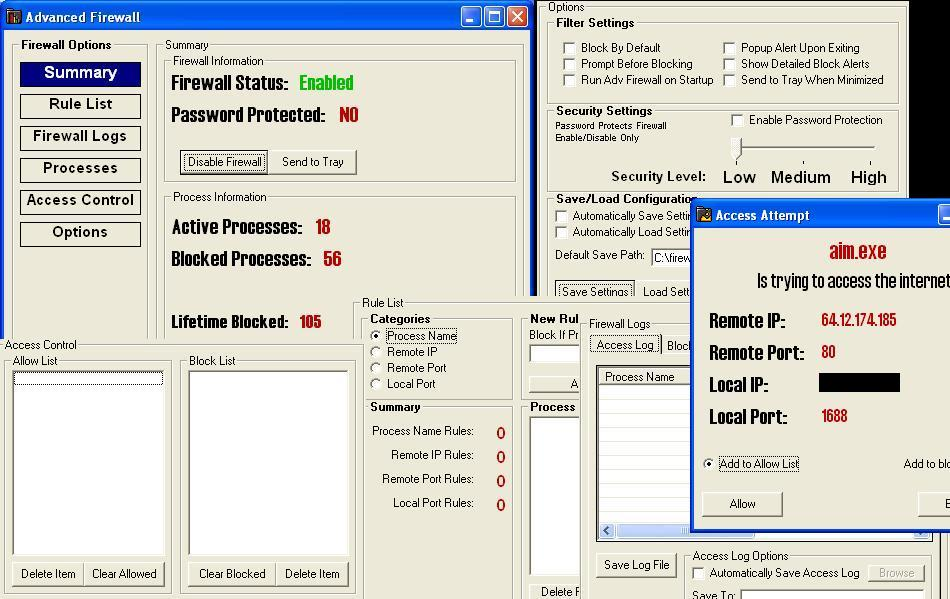



## \[Advanced Firewall\]

### Description

Advanced Firewall application which blocks all TCP process based on rules you specify such as Remote Port, Process Name, Remote IP, and Local Port. Logs all activity and gives option to save log files. You can also save your settings and import/export them. You can block All processes by default and allow them based on a set of rules or block only based on those rules. You can password protect the firewall and its functions with 3 different security levels. There is also detailed or simple alerts to notify you when a process is found...plus many more functions. If I get some good responses Ill continue with this project. If you notice any bugs or things you`d like to see let me know.
 
### More Info
 

             |
---                |---
**Submitted On**   |2004-12-15 18:21:04
**By**             |[Eric Wolcott](https://github.com/Planet-Source-Code/PSCIndex/blob/master/ByAuthor/eric-wolcott.md)
**Level**          |Intermediate
**User Rating**    |4.9 (73 globes from 15 users)
**Compatibility**  |VB 5\.0, VB 6\.0
**Category**       |[Internet/ HTML](https://github.com/Planet-Source-Code/PSCIndex/blob/master/ByCategory/internet-html__1-34.md)
**World**          |[Visual Basic](https://github.com/Planet-Source-Code/PSCIndex/blob/master/ByWorld/visual-basic.md)
**Archive File**   |[\[Advanced\_18298112152004\.zip](https://github.com/Planet-Source-Code/eric-wolcott-advanced-firewall__1-57742/archive/master.zip)

